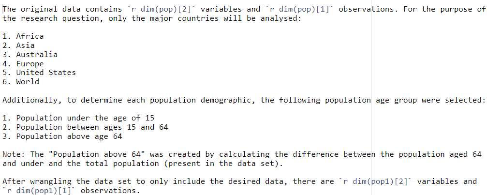

```{r setup, include=FALSE}
knitr::opts_chunk$set(echo = TRUE)
```


```{r global, include=FALSE}
library(tidyverse)
library(knitr)
library(scales)

pop <- read.csv("Data/population-and-demography.csv")

pop$pop65plus <- pop$Population - pop$Population.aged.15.to.64.years - pop$Population.of.children.under.the.age.of.15

pop1 <- pop %>%
  select(Country.name, Year, Population.of.children.under.the.age.of.15, Population.aged.15.to.64.years, pop65plus) %>%
  rename("Country" = "Country.name", "Population_under_age_15" = "Population.of.children.under.the.age.of.15", 
         "Population_between_age_15_and_64" = "Population.aged.15.to.64.years",  "Population_above_age_64" = "pop65plus") %>%
  filter(Country %in% c("Africa (UN)", "Asia (UN)", "Australia", "Europe (UN)", "United States", "World"))
```


# Research Question

Mankind has significantly advanced over the years especially within the medical and technological areas. With this in mind, has human advancement improved the survivability of mankind? 

# Data Set Introduction

The data set contains a population across different age groups for a significant number of countries from 1950 to 2021.The data was sourced from [Our World at Data](https://ourworldindata.org/world-population-growth). 

In order to investigate the effects of human advancement on the population, the variables in the below table will be used. By using three different age groups, we can identify any trends in the number of the young (under age 15), the middle (ages 15-64) and the old (above age 64) from 1950 across the major countries. These age groups were selected as it is somewhat believed the young and old are the more vulnerable and if human advancement has helped them survive. 

```{r, echo=FALSE}
var <- names(pop1)
var_df <- data.frame(Variable_Names = var)
var1 <- kable(var_df)
print(var1)

```


# Data Set Description

For the purpose of the 

The original data contains `r dim(pop)[2]` variables and `r dim(pop)[1]` observations. For the purpose of the research question, only the major countries will be analysed:

1. Africa
2. Asia
3. Australia
4. Europe
5. United States
6. World

Additionally, to determine each population demographic, the following population age group were selected:

1. Population under the age of 15
2. Population between ages 15 and 64
3. Population above age 64

Note: The "Population above 64" was created by calculating the difference between the population aged 64 and under and the total population (present in the data set).

After wrangling the data set to only include the desired data, there are `r dim(pop1)[2]` variables and `r dim(pop1)[1]` observations. 

```{r, echo=FALSE}

```

As below, the type of each variables are shown. Country is a character variable. Year and the population variables are all numerical variables but year and Population_under_age_15 are integer variables meaning they represent whole numbers without decimals. The other are numeric variables which can be both integer and decimal numbers but for the context of this analysis, it does not make any difference. 

```{r, echo=FALSE}
str(head(pop1, n = 2))
```


# Data Summary


```{r, echo=FALSE}
sum_stats <- pop1 %>%
  group_by(Country) %>%
  summarise(mean_pop_under_15 = mean(Population_under_age_15),
            var_pop_under_15 = var(Population_under_age_15),
            mean_pop_over_64 = mean(Population_above_age_64),
            var_pop_over_64 = var(Population_above_age_64))

kable(sum_stats, caption = "Mean and Variance of populations under 15 and above 64 of each country.", format.args = list(big.mark = ",", scientific = FALSE))

```

Upon observation of the data summary above, Asia has the **largest** mean and variance across both population groups. The variance is especially large for Asia compared to other countries where the age of the population is above 64 which may indicate a several possibilities or outcomes.


# Visualisations

```{r, echo=FALSE}


ggplot(data = pop1, aes(x = Year)) +
  geom_line(aes(y = Population_above_age_64, color = "Population above age 64")) +
  geom_line(aes(y = Population_under_age_15, color = "Population under age 15")) +
  geom_line(aes(y = Population_between_age_15_and_64, color = "Population between age 15 and 64")) +
  labs(x = "Year", y = "Population", title = "Populations of Countries Over Time", color = "Population Type") +
  scale_color_manual(values = c("dark blue", "dark orange", "turquoise"),
                     labels = c("Population age < 15", "Populationn age 15-64", "Population age > 64"),
                     breaks = c("Population under age 15", "Population between age 15 and 64", "Population above age 64")) +
  theme(legend.position = "right", plot.title = element_text(hjust = 0.5)) +
  facet_wrap(~ Country, scales = "free_y", ncol = 2) +
  scale_y_continuous(labels = comma)

```

* _For all countries and population where the age is above 64, there are noticeable upward curves towards 2020 indicating human advancement has in fact increased the population age above 64._
* _Among all the countries above, the population is generally increasing over the time however Europe does not appear to follow this trend._

# Conclusions

From the data and visualisations, it is apparent that human advancement has definitely made an effect on the population of the world from 1950 to 2021. However, for Europe, there appears to be significant factors affecting the population as it appears the population under age 15 has decreased over the period. Although the population under age 15 in other countries does not seem to have a steady trend, there is still an upward trend overall. Africa has a uniform upward trend in their population indicating improvements in medical care and other various factors. Furthermore, for the overall world, with enhancements in medicines and technology, the population is still increasing in all 3 age groups. 